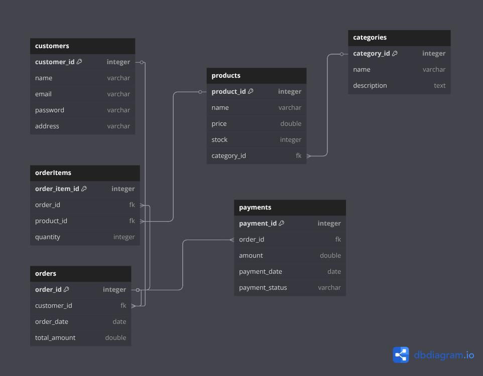

# 📦 ECommerce Java App

[](LICENSE)
[](https://www.oracle.com/java/)
[](https://spring.io/projects/spring-boot)
[](https://angular.io/)
[](https://www.postgresql.org/)
[](https://nx.dev/)
[](https://www.docker.com/)

---

## 📚 Table of Contents

- [Overview](#overview)
- [Features](#-features)
- [Technologies Used](#-technologies-used)
- [ER Diagram](#-er-diagram)
- [Requirements](#️-requirements)
- [How to Run](#-how-to-run-the-project)
- [Nx CLI Commands](#-useful-nx-cli-commands)
- [CI with Nx Cloud](#-continuous-integration-ci-with-nx-cloud-optional)
- [Useful Links](#-useful-links)
- [About](#-about)

---

## Overview

**ECommerce** is a **full-stack ECommerce platform** that allows management of products, orders, customers, and users.  
It consists of a **Spring Boot** backend and an **Angular** frontend structured with **Nx Monorepo** for modular and scalable development.

---

## ✨ Features

### Backend
- Product CRUD operations
- Customer management
- Order processing
- User authentication & authorization
- RESTful API
- Dockerized backend for easy deployment

### Frontend
- Responsive UI
- Product listing & filtering
- Shopping cart functionality
- Login, registration, profile management
- Order history & tracking

---

## 🧰 Technologies Used

### Backend
- **Java 17+**
- **Spring Boot**
- **PostgreSQL**
- **Maven**
- **JUnit**
- **Docker**
- **Thymeleaf** *(optional)*

### Frontend
- **Angular**
- **TypeScript**
- **HTML / CSS**
- **Tailwindcss**
- **RxJS**
- **npm**
- **Nx Dev** (Monorepo tool for Angular workspace)

### DevOps / Tools
- **Nx CLI**
- **Nx Cloud (optional CI)**
- **Docker**

---

## 🧱 ER Diagram



---

## ⚙️ Requirements

### Backend
- Java 21
- Maven 3.8+
- PostgreSQL
- Docker (for containerization)
- IDE: IntelliJ / VS Code

### Frontend
- Node.js 20
- npm
- Angular CLI
- Nx CLI (`npx nx`)

---

## 🚀 How to Run the Project

```bash
# Run Angular frontend in dev mode
npx nx serve ecommerce-frontend

# Build frontend for production
npx nx build ecommerce-frontend

# Run Spring Boot backend (via Docker)
docker-compose up --build

# Or run backend locally
cd ecommerce-backend
./mvnw spring-boot:run
